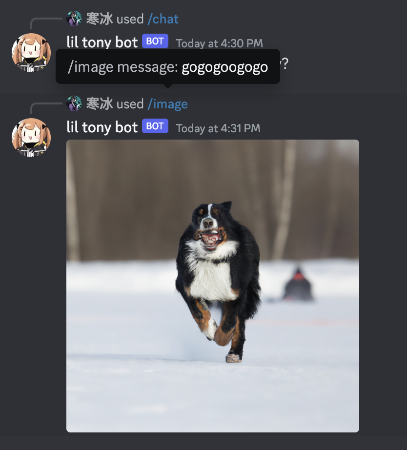
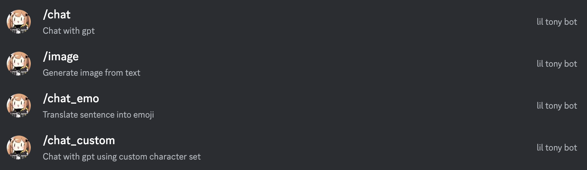
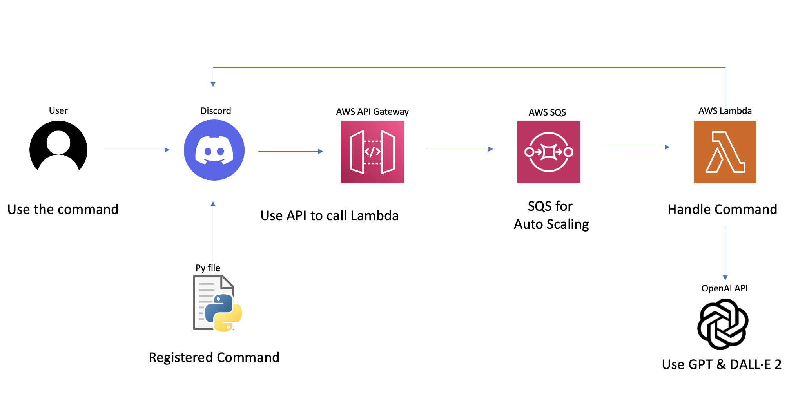
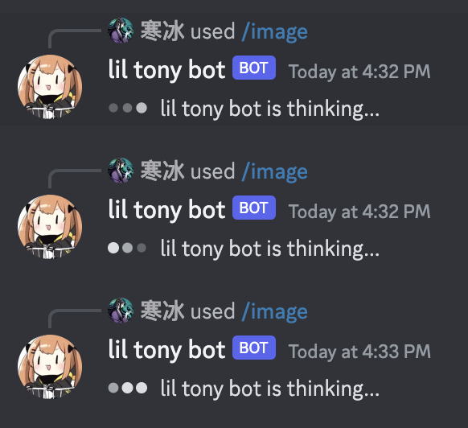

# My Discord Bot on AWS Lambda

Welcome to the repository of a Discord bot that operates seamlessly on AWS Lambda which it's almost free. The bot is proficient in interacting with the OpenAI API, bringing a swift and powerful AI tool right into your Discord server!

<p align="center">
  
</p>

## Add to your Server
[Discord Bot](https://discord.com/api/oauth2/authorize?client_id=1159000090048991363&permissions=8&scope=bot) <- click here to add to your server



Commands:
- `/chat <message>`: Chat with the bot
- `/chat_emo <message>`: Chat with the bot with emojis
- `/chat_multplechoice <message>`: Chat with the bot with multiple choice
- `/chat_custom <message>`: Chat with the bot with custom prompt
- `/image <message>`: Generate an image from the bot
## How it Works



The bot is comfortably hosted on [AWS Lambda](https://aws.amazon.com/pm/lambda), employing the [Discord Interactions Endpoint](https://discord.com/developers/docs/interactions/application-commands) to gracefully handle user commands within a Discord server. The backbone is crafted using [Flask](https://flask.palletsprojects.com/) to manage the HTTP server functionalities.

Leveraging the [AWS CDK](https://aws.amazon.com/cdk/), the bot is nestled within a Docker container on AWS Lambda. It is paired with an integrated API Gateway, ensuring a fluid and uninterrupted user experience. The bot also uses [SQS](https://aws.amazon.com/sqs/) to smartly auto-scale, avoiding any potential failures or disruptions.

<p align="center">
  
</p>

## Setup

### Preparations

1. Initiate by creating a Discord application and bot at the [Discord Developer Portal](https://discord.com/developers/applications).

2. Generate a `.env` file within `src/app` containing the following keys:
    ```sh
    DISCORD_PUBLIC_KEY=""
    OPENAI_API_KEY=""
    BOT_TOKEN=""
    BOT_APP_ID=""
    ```
3. Similarly, create a `.env` file inside `commands` with these keys:
    ```sh
    DISCORD_PUBLIC_KEY=""
    BOT_TOKEN=""
    BOT_APP_ID=""
    ```
4. Finally, formulate a `.env` file in `lib/discord-bot-lambda-stack.ts` featuring this key:
    ```sh
    DISCORD_PUBLIC_KEY=""
    ```

### Registering the Commands

- To bring your bot to life, commence by registering the commands with Discord.
- Customize the `discord_commands.yaml` file, injecting your creativity through unique commands.
- Ensure the necessary dependencies are satisfied by installing what’s listed in `requirements.txt`:
    ```sh
    pip install -r commands/requirements.txt
    ```
- Navigate to `register_commands.py`, and refresh the API key and application ID with your personalized details. Execute the `register_commands.py` script residing within the `commands` directory:
    ```sh
    cd commands
    python register_commands.py
    ```

### Testing Locally

- Begin by launching your bot as a Flask application:
    ```sh
    python src/app/main.py
    ```
- You may initiate a test request to the Flask app using the following:
    ```sh
    curl -X POST -H "Content-Type: application/json" -d @test_request.json http://127.0.0.1:5000/
    ```
  Note: Ensure that the request holds a valid token aligning with the public key, as it won’t synchronize with the `@verify_key_decorator` otherwise.
- You may also test the bot functionality by running the following command:
    ```sh
    python src/app/test_bot.py
    ```
- To test the CDK, run the following command:
    ```sh
    npx jest
    ```

### Deploying to AWS Lambda

- Once all tokens and keys are meticulously updated, you are set to expose your bot on AWS Lambda.
- Post-deployment, an API endpoint resembling `https://xxxxx.execute-api.us-east-1.amazonaws.com/prod/` will be exposed.
- Propel your Discord application’s interactions endpoint to synchronize with this newfound URL on your [Discord Developer Portal](https://discord.com/developers/applications).
- Prioritize bootstrapping the CDK if it hasn’t been addressed already:
    ```sh
    cdk bootstrap
    ```
- Conclude by deploying using the subsequent command, ensuring your AWS CLI configurations are fortified and resilient:
    ```sh
    cdk deploy
    ```

Enjoy the harmonious interaction of your Discord bot within your server!
